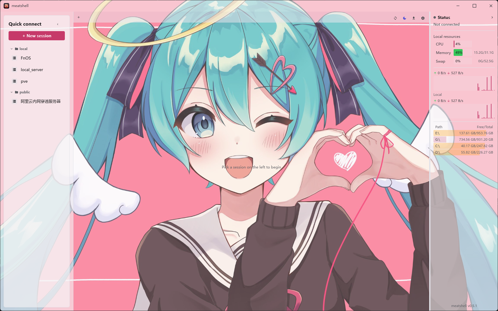
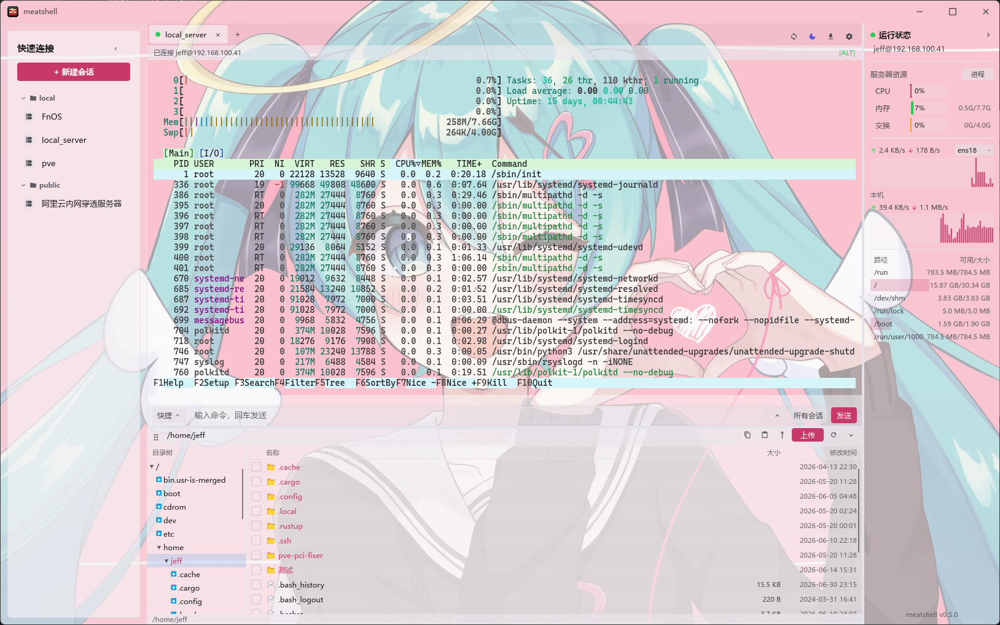

# Probe Shell

[简体中文](./README.md) | **English**

A lightweight, low-memory SSH / terminal client inspired by FinalShell, but
written entirely in **Rust + [Slint](https://slint.dev)**. The goal is to keep
FinalShell's core experience (resource-monitor sidebar, session management,
tabbed terminals) while cutting memory use from the 400 MB+ of a JVM app down to
the tens-of-MB range of a native binary.

## Fork / License note

Probe Shell is a renamed and customized fork of the original open-source project.
It remains licensed as `MIT OR Apache-2.0`; original license and contributor credits are retained, while future UI, features and releases follow Probe Shell.

## Screenshots

<p align="center">
  <br>
  <em>Welcome page: session management + local resource monitor sidebar</em>
</p>

<p align="center">
  <br>
  <em>Tabbed terminal (full-screen btop) + SFTP file browser + remote resource monitoring</em>
</p>

## Download & install

The current Probe Shell preview workflow builds **Windows x86_64** by default and publishes artifacts to the [Releases](https://github.com/OnlyChallenger/probe-shell/releases) page. Manual `Release` workflow runs produce the portable ZIP by default; enable `build_msi` when you also need the installer.

### Windows

Download `probe-shell-*-windows-x86_64.zip`, unzip, and run `probe-shell.exe`.

### Linux

```bash
tar -xzf probe-shell-*-linux-x86_64.tar.gz
cd probe-shell-*-linux-x86_64
./probe-shell                                  # run it directly
# Optional: install the app icon + launcher entry (shows the icon in the dock /
# app list — no argument needed, it finds the binary next to the script)
chmod +x install-linux.sh && ./install-linux.sh
```

> Requires glibc ≥ 2.35 (Ubuntu 22.04+ / Debian 12+). On Wayland you may need to
> log out/in once after installing the icon.

### macOS

The download is a `.zip` containing the `probe-shell.app` bundle:

```bash
# Unzip (aarch64 = Apple Silicon, x86_64 = Intel)
unzip probe-shell-*-macos-*.zip
# Move it to Applications (optional — it also runs in place)
mv probe-shell.app /Applications/
# Clear the quarantine flag, otherwise macOS says "probe-shell is damaged and can't be opened"
xattr -dr com.apple.quarantine /Applications/probe-shell.app
# Open it (or double-click in Finder)
open /Applications/probe-shell.app
```

> If you didn't move it to `/Applications`, point both paths above at wherever the `.app` actually is (e.g. `~/Downloads/probe-shell.app`).

> To build from source, see [Running](#running) below.

## Logs and crash diagnostics

- Warnings/errors: `log/error.log` beside the portable executable.
- Hard crashes / panics: `log/crash.log`, including panic payload, source location and backtrace.

When reporting a crash, include both files if possible.


## v0.5.3-probe1 innovation preview

- Smart session cards: detects OpenWrt, Router, NAS, Docker, Linux, Cloud, Windows, Serial and Telnet from local session metadata.
- Session search: a compact search box for name, host, user, note and group.
- Privacy mode: masks host/IP and username in the session list for screenshots.
- Starter quick ops: new installs get small System / OpenWrt / Docker command groups. Existing custom commands are not touched.
- Connection error hints: common disconnect reasons get a short human-readable explanation.

The UI changes are intentionally small: one search field, one privacy button and clearer session rows with elided text, to avoid overlap and clipping.

## Features

### Done

- [x] FinalShell-style UI with dark / light / follow-system themes
- [x] Local + remote resource monitoring (CPU / memory / swap / network / disk)
- [x] Remote process monitor (read-only table sorted by CPU)
- [x] Full VT/ANSI terminal emulation (btop / htop / vim render correctly)
- [x] Tabs (welcome page + multiple sessions)
- [x] Session management: create / edit / delete / groups, local JSON, export / import
  - Config location: `%APPDATA%/probe-shell/sessions.json` (Windows)
    / `~/.config/probe-shell/sessions.json` (Linux)
    / `~/Library/Application Support/probe-shell/sessions.json` (macOS)
- [x] SSH (`russh`, pure Rust): password / private key / encrypted key (passphrase)
- [x] SFTP browser + upload / download (drag-and-drop) + in-terminal ZMODEM (`sz`) receive
- [x] SSH port forwarding / tunnels: local -L / remote -R / dynamic -D (SOCKS5)
- [x] Quick commands + command box (broadcast to all sessions) + command history
- [x] Serial / Telnet sessions
- [x] Outbound proxy (SOCKS5 / HTTP)
- [x] Import `~/.ssh/config`
- [x] Session passwords encrypted at rest (ChaCha20-Poly1305)

### Planned

- [x] Known-hosts (`known_hosts`) verification
- [ ] Store session passwords in the OS keychain
- [ ] Split panes for tabbed terminals

## Tech stack

| Module        | Choice                                                            |
| ------------- | ----------------------------------------------------------------- |
| UI            | [Slint](https://slint.dev) (compiled pure Rust, no GC)            |
| Async runtime | [`tokio`](https://tokio.rs)                                       |
| SSH protocol  | [`russh`](https://crates.io/crates/russh) (no libssh dependency)  |
| System metrics| [`sysinfo`](https://crates.io/crates/sysinfo)                     |
| Serialization | `serde` + `serde_json`                                            |
| Logging       | `tracing` + `tracing-subscriber`                                  |

## Running

```bash
cargo run --release
```

On first launch an empty session store is created at
`%APPDATA%/probe-shell/sessions.json`. Click **"＋ New Session"** in the top-right
to add your first server.

## Project layout

```
probe-shell/
├── Cargo.toml
├── build.rs                 # Slint compiler entry point
├── ui/
│   ├── app.slint            # top-level window
│   ├── theme.slint          # design tokens
│   ├── widgets.slint        # reusable buttons / inputs / sparkline
│   ├── sidebar.slint        # left-hand system monitor panel
│   ├── tabs.slint           # top tab bar
│   ├── welcome.slint        # welcome page / quick connect
│   ├── session_dialog.slint # new / edit session dialog
│   └── terminal_view.slint  # terminal view (v0.1 line-buffered)
└── src/
    ├── main.rs
    ├── app.rs               # UI ↔ backend bridge
    ├── config.rs            # session JSON persistence
    ├── system.rs            # CPU / memory / network sampling
    └── ssh.rs               # SSH session worker
```

## Development notes

- Slint widgets use a strict layout DSL; after editing a `.slint` file,
  `cargo check` is the fastest feedback loop.
- The application event loop is single-threaded (required by Slint); all
  cross-thread UI updates go through `slint::invoke_from_event_loop` callbacks.
- `check_server_key` currently accepts any server key (like
  `StrictHostKeyChecking=no`); wire up known-hosts verification before
  production use.

## License

Dual-licensed under MIT OR Apache-2.0.


## Probe Shell preview release note

The current preview Release workflow intentionally builds only the Windows x86_64 portable ZIP. AUR publishing, MSI, Linux, and macOS packaging are disabled for now to keep releases stable while the project is being customized.

## v0.6 SFTP / file-browser fix

Probe Shell v0.6 tries the standard SFTP subsystem first.
If the server does not provide SFTP, such as many OpenWrt / Dropbear routers, it automatically falls back to SSH file-browser mode.
This fallback does not require `openssh-sftp-server` and can still browse internal directories such as `/etc`, `/root`, and `/www`.

The fallback currently supports browsing, entering folders, mkdir, touch, delete, rename, chmod, opening/saving UTF-8 text files, and single-file downloads.
For bulk upload/download, install `openssh-sftp-server` on the server and use full SFTP.


### v0.6.2-probe1 update notes

This build focuses on product polish rather than adding visual complexity: light mode is opaque and readable, clicking an existing session jumps to its current tab, SSH-browser file browsing is preferred for OpenWrt/Dropbear devices, folders can be opened directly from the file panel, the SFTP tree/list divider is resizable, Telnet defaults to port 23, and router IPv6/firewall quick commands are included.


### v0.6.2-probe1 stability note

This build coalesces repeated saved-session clicks and guards failed connection events so double-clicking or re-clicking a failed record should not crash the app.


### v0.6.2-probe2

- Fixed repeated failed-session click / Enter reconnect crash (`RefCell already borrowed`).
- Muted the light theme to opaque soft blue-gray surfaces for readability.
- Reduced and clamped the default/restored window size to better fit Windows high-DPI displays.
### v0.6.3-probe2

- Directory tree nodes can now be checked and right-clicked.
- When a tree folder is checked, pressing Enter in the SFTP search box or clicking the search icon searches from that folder.
- The existing current-directory local filter is preserved and does not add extra server requests while typing.


### v0.6.4 Probe Shell 搜索交互说明

- 文件搜索现在在后台运行，搜索期间可以继续切换会话、展开目录、刷新当前目录。
- 工具栏提供“停止”按钮，用于取消当前递归搜索。
- 底部状态栏会显示当前搜索范围和正在扫描的目录。
- 勾选目录树中的文件夹只表示搜索范围；不勾选时默认搜索当前路径。


### v0.6.4-probe2 交互修复

- 左侧会话单击：切换到已打开的 SSH/Telnet 页面；未打开时只打开一个页面。
- 左侧会话双击：强制新开一个 SSH/Telnet 页面，并自动追加 `#2/#3` 标签名。
- 文件搜索保留后台异步执行与停止按钮，搜索中仍可展开目录和切换标签。

### 操作日志 / Operation log

Probe Shell 会把 SFTP/SSH 文件面板里的常见操作记录到本地 `log/operations.log`，包括上传、下载、搜索、新建、删除、重命名、权限修改、查看、编辑和保存。日志只记录时间、行为和路径，不记录文件内容、密码或私钥。文件面板工具栏里的“操作日志”图标可以直接打开该日志文件。

