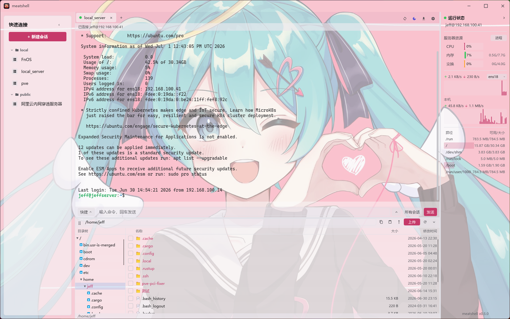

# Probe Shell

**简体中文** | [English](./README.en.md)

一个轻量级、低内存占用的 SSH / 终端客户端，灵感来自 FinalShell，但完全由
**Rust + [Slint](https://slint.dev)** 实现。目标是保留 FinalShell 的核心体验
（资源监控侧栏、会话管理、多标签页终端）的同时，把内存占用从 400 MB+ 的
JVM 压到几十 MB 原生级别。

## Fork / 许可证说明

Probe Shell 基于原开源项目重命名和改造，继续遵循 `MIT OR Apache-2.0`。
保留原许可证和贡献者署名；后续功能、UI 和发布流程以 Probe Shell 为准。

## 截图

<p align="center">
  <br>
  <em>欢迎页：会话管理 + 左侧本机资源监控</em>
</p>

<p align="center">
  <br>
  <em>多标签页终端（htop 全屏渲染）+ 底部 SFTP 文件浏览 + 远端资源监控</em>
</p>


## v0.6.5 文件管理增强

- 支持目录树多选作为递归搜索范围。
- SFTP 文件面板增加快捷访问栏：根目录、HOME、ETC、VAR、TMP、WWW、OVERLAY。
- 勾选文件后提供复制路径、下载、清除选择等安全批量操作。
- 搜索仍为后台任务，可停止，不应阻塞目录展开和标签切换。

## 下载与安装

当前 Probe Shell 预览版的 GitHub Actions 默认只构建 **Windows x86_64**。
发布到 [Releases](https://github.com/OnlyChallenger/probe-shell/releases) 页面。
手动运行 `Release` workflow 时默认只生成 ZIP；需要安装包时勾选 `build_msi`。

### Windows

下载 `probe-shell-*-windows-x86_64.zip`，解压后双击 `probe-shell.exe`。

### Linux

```bash
tar -xzf probe-shell-*-linux-x86_64.tar.gz
cd probe-shell-*-linux-x86_64
./probe-shell                                  # 直接运行
# 可选：装应用图标 + 启动器入口（Dock / 应用列表里显示图标，无需传参）
chmod +x install-linux.sh && ./install-linux.sh
```

> 需要 glibc ≥ 2.35（Ubuntu 22.04+ / Debian 12+）。Wayland 下首次装完图标可能要注销重登一次。

### macOS

下载得到的是 `.zip`，里面是 `probe-shell.app` 应用程序包：

```bash
# 解压(aarch64 = Apple 芯片，x86_64 = Intel)
unzip probe-shell-*-macos-*.zip
# 移到「应用程序」(可选，留在原地也行)
mv probe-shell.app /Applications/
# 去掉「未签名应用」的隔离属性，否则会提示「probe-shell 已损坏，无法打开」
xattr -dr com.apple.quarantine /Applications/probe-shell.app
# 打开(或在「访达」里双击)
open /Applications/probe-shell.app
```

> 若未移到 `/Applications`，把上面两条路径换成 `.app` 实际所在位置(如 `~/Downloads/probe-shell.app`)即可。

> 从源码构建见下方 [运行](#运行)。

## 日志与崩溃诊断

- 普通警告/错误日志：程序目录旁的 `log/error.log`。
- 闪退/ panic 诊断：程序目录旁的 `log/crash.log`，包含 panic 信息、源码位置和 backtrace。

如果遇到闪退，优先把这两个文件一起发出来分析。


## v0.5.3-probe1 创新版重点

- 智能会话卡片：自动按名称 / 主机 / 用户 / 备注识别 OpenWrt、路由器、NAS、Docker、Linux、云服务器等类型。
- 会话搜索：欢迎页新增轻量搜索框，支持名称、Host、用户、备注、分组。
- 隐私模式：一键隐藏 IP / 主机名 / 用户名，方便截图反馈。
- 一键运维命令：新安装默认带 System / OpenWrt / Docker 三组小而实用的快捷命令。
- 连接失败解释：常见断开原因会附带中文/英文人话提示。

UI 改动保持克制：只增加一个搜索框、一个隐私按钮和更清晰的会话卡片，文本均使用省略显示，避免重叠和遮挡。

## 功能

### 已实现

- [x] FinalShell 风格 UI，深色 / 浅色 / 跟随系统主题
- [x] 本机 + 远端资源监控（CPU / 内存 / 交换 / 网络 / 磁盘）
- [x] 远端进程监控（按 CPU 排序的只读进程表）
- [x] 完整 VT/ANSI 终端模拟（btop / htop / vim 全屏正常渲染）
- [x] 多标签页（欢迎页 + 多个会话）
- [x] 会话管理：新建 / 编辑 / 删除 / 分组，本地 JSON 持久化，导出 / 导入
  - 配置位置：`%APPDATA%/probe-shell/sessions.json`（Windows）
    / `~/.config/probe-shell/sessions.json`（Linux）
    / `~/Library/Application Support/probe-shell/sessions.json`（macOS）
- [x] SSH（`russh`，纯 Rust）：密码 / 私钥 / 加密私钥（密码短语）
- [x] SFTP 文件浏览 + 上传 / 下载（拖拽）+ 终端内 ZMODEM（`sz`）接收
- [x] SSH 端口转发 / 隧道：本地 -L / 远程 -R / 动态 -D（SOCKS5）
- [x] 快捷命令 + 命令输入框（可群发到所有会话）+ 命令历史
- [x] 串口 / Telnet 会话
- [x] 出站代理（SOCKS5 / HTTP）
- [x] 导入 `~/.ssh/config`
- [x] 会话密码加密存储（ChaCha20-Poly1305）

### 计划中

- [x] 已知主机 (known_hosts) 校验
- [ ] 会话密码改用 OS 钥匙串存储
- [x] 多标签页终端分屏

## 技术栈

| 模块          | 选型                                                              |
| ------------- | ----------------------------------------------------------------- |
| UI            | [Slint](https://slint.dev)（纯 Rust 编译，无 GC）                 |
| 异步运行时    | [`tokio`](https://tokio.rs)                                       |
| SSH 协议      | [`russh`](https://crates.io/crates/russh)（无 libssh 依赖）       |
| 系统指标      | [`sysinfo`](https://crates.io/crates/sysinfo)                     |
| 序列化        | `serde` + `serde_json`                                            |
| 日志          | `tracing` + `tracing-subscriber`                                  |

## 运行

```bash
cargo run --release
```

首次启动会在 `%APPDATA%/probe-shell/sessions.json` 建立空的会话库。点击右上
角 **“＋ 新建会话”** 添加第一台服务器。

## 项目布局

```
probe-shell/
├── Cargo.toml
├── build.rs                 # Slint 编译器入口
├── ui/
│   ├── app.slint            # 顶层窗口
│   ├── theme.slint          # 设计 tokens
│   ├── widgets.slint        # 可复用按钮 / 输入框 / sparkline
│   ├── sidebar.slint        # 左侧系统监控面板
│   ├── tabs.slint           # 顶部标签栏
│   ├── welcome.slint        # 欢迎页 / 快速连接
│   ├── session_dialog.slint # 新建 / 编辑会话弹框
│   └── terminal_view.slint  # 终端视图（v0.1 行缓冲）
└── src/
    ├── main.rs
    ├── app.rs               # UI ↔ 后端桥接
    ├── app_state.rs         # 会话 / 面板共享状态类型
    ├── config.rs            # 会话 JSON 持久化
    ├── system.rs            # CPU / 内存 / 网络采样
    └── ssh.rs               # SSH 会话 worker
```

## 开发提示

- Slint 控件有非常严格的布局 DSL，改 `.slint` 后 `cargo check` 是最快的
  反馈方式。
- 应用事件循环是单线程（Slint 要求），所有跨线程 UI 更新通过
  `slint::invoke_from_event_loop` 回调。
- 已接入 known_hosts / TOFU 校验：首次连接确认指纹，后续自动校验，密钥变化会提醒。

## 赞赏 / 请我喝杯咖啡

觉得作品还不错的话，请我喝杯咖啡吧 ☕

<p align="center">
  <strong>亮出网络乞丐乞讨专用码</strong><br>
  
</p>

## License

MIT OR Apache-2.0（双许可）。


## Probe Shell preview release note

The current preview Release workflow intentionally builds only the Windows x86_64 portable ZIP. AUR publishing, MSI, Linux, and macOS packaging are disabled for now to keep releases stable while the project is being customized.

## v0.6 SFTP / 文件浏览修复

Probe Shell v0.6 会优先使用标准 SFTP subsystem。
如果服务器没有开放 SFTP，例如部分 OpenWrt / Dropbear 路由器，程序会自动切换到 SSH 文件浏览模式。
这个模式不需要服务器安装 openssh-sftp-server，也可以浏览 `/etc`、`/root`、`/www` 等内部目录。

当前 fallback 支持：目录浏览、进入文件夹、新建文件夹、新建文件、删除、重命名、chmod、打开/保存 UTF-8 文本、单文件下载。
大批量上传下载仍建议服务器安装 openssh-sftp-server 后使用完整 SFTP。


### v0.6.2-probe1 update notes

This build focuses on product polish rather than adding visual complexity: light mode is opaque and readable, clicking an existing session jumps to its current tab, SSH-browser file browsing is preferred for OpenWrt/Dropbear devices, folders can be opened directly from the file panel, the SFTP tree/list divider is resizable, Telnet defaults to port 23, and router IPv6/firewall quick commands are included.


### v0.6.2-probe1 stability note

This build coalesces repeated saved-session clicks and guards failed connection events so double-clicking or re-clicking a failed record should not crash the app.


### v0.6.2-probe2

- Fixed repeated failed-session click / Enter reconnect crash (`RefCell already borrowed`).
- Muted the light theme to opaque soft blue-gray surfaces for readability.
- Reduced and clamped the default/restored window size to better fit Windows high-DPI displays.
### v0.6.3-probe2

- 目录树支持勾选与右键菜单。
- 勾选目录后，SFTP 搜索框回车或点击搜索图标会从该目录搜索文件/文件夹。
- 当前目录本地过滤仍然保留，不会频繁访问服务器。


### v0.6.4 Probe Shell 搜索交互说明

- 文件搜索现在在后台运行，搜索期间可以继续切换会话、展开目录、刷新当前目录。
- 工具栏提供“停止”按钮，用于取消当前递归搜索。
- 底部状态栏会显示当前搜索范围和正在扫描的目录。
- 勾选目录树中的文件夹只表示搜索范围；不勾选时默认搜索当前路径。


### v0.6.4-probe2 交互修复

- 左侧会话单击：切换到已打开的 SSH/Telnet 页面；未打开时只打开一个页面。
- 左侧会话双击：强制新开一个 SSH/Telnet 页面，并自动追加 `#2/#3` 标签名。
- 文件搜索保留后台异步执行与停止按钮，搜索中仍可展开目录和切换标签。

### 操作日志 / Operation log

Probe Shell 会把 SFTP/SSH 文件面板里的常见操作记录到本地 `log/operations.log`，包括上传、下载、搜索、新建、删除、重命名、权限修改、查看、编辑和保存。日志只记录时间、行为和路径，不记录文件内容、密码或私钥。文件面板工具栏里的“操作日志”图标可以直接打开该日志文件。

